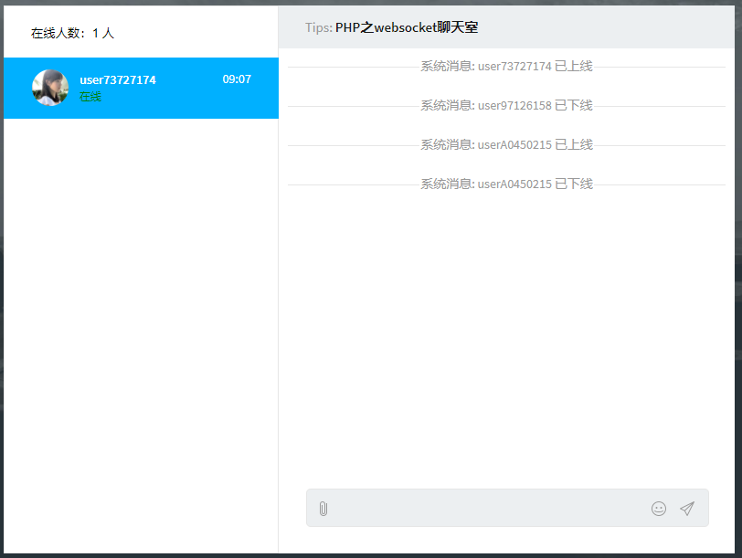
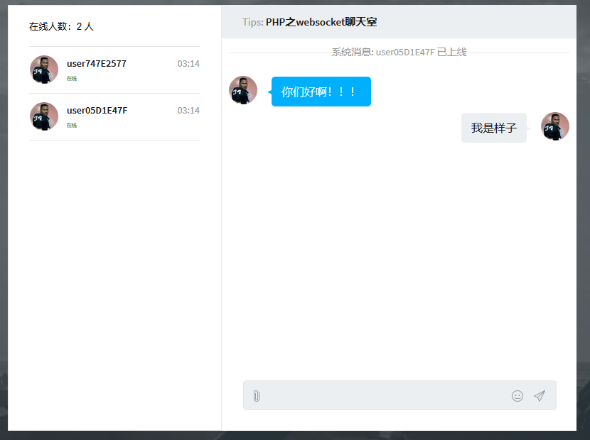
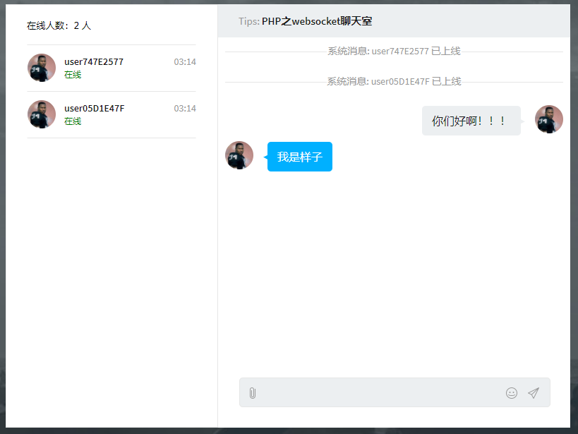

# websocket
一个 PHP 的 websocket 的聊天室

## 更新

- 2019-01-14 修复用户下线提示BUG，新增启动服务bat文件

- 2019-12-30 更新README.md

## 使用

- 下载源码

- 在控制台执行命令：php socketServer.php

- 最后运行client.html

## 界面

具体设计可查看：[网页实时聊天之PHP实现websocket](https://www.cnblogs.com/yang-2018/p/10762565.html)
